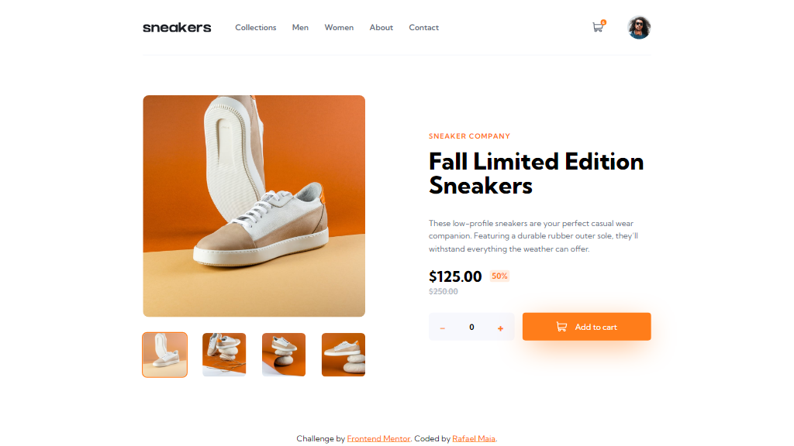

# Frontend Mentor - E-commerce product page solution

This is a solution to the [E-commerce product page challenge on Frontend Mentor](https://www.frontendmentor.io/challenges/ecommerce-product-page-UPsZ9MJp6). Frontend Mentor challenges help you improve your coding skills by building realistic projects.

## Table of contents

- [Overview](#overview)
  - [The challenge](#the-challenge)
  - [Screenshot](#screenshot)
  - [Links](#links)
- [My process](#my-process)
  - [Built with](#built-with)
  - [Useful resources](#useful-resources)
- [Author](#author)
- [donate](#donate)

## Overview

### The challenge

Users should be able to:

- View the optimal layout for the site depending on their device's screen size
- See hover states for all interactive elements on the page
- Open a lightbox gallery by clicking on the large product image
- Switch the large product image by clicking on the small thumbnail images
- Add items to the cart
- View the cart and remove items from it

### Screenshot

### Links

- Solution URL: [https://github.com/rafaeldevvv/frontendmentor-ecommerce-product-page](https://github.com/rafaeldevvv/frontendmentor-ecommerce-product-page)
- Live Site URL: [https://rafaeldevvv.github.io/frontendmentor-ecommerce-product-page/](https://rafaeldevvv.github.io/frontendmentor-ecommerce-product-page/)

## My process

### Built with

- Semantic HTML5 markup
- CSS custom properties
- Flexbox
- CSS Grid
- Mobile-first workflow
- [React](https://reactjs.org/) - JS library
- [tailwindcss](https://tailwindcss.com)
- [Framer Motion](https://www.framer.com/motion/)
- [react-toastify](https://github.com/fkhadra/react-toastify)

### Useful resources

- [css-unit-converter-js](https://cssunitconverter.vercel.app/blog/css-unit-converter-js-npm-package-release) - Package for converting css units
- [Framer Motion Navigation menu animation example](https://codesandbox.io/p/sandbox/framer-motion-side-menu-mx2rw?file=%2Fsrc%2FExample.tsx%3A19%2C18&from-embed=)
- [Calc of max, or max of calc in CSS](<https://stackoverflow.com/questions/16617248/calc-of-max-or-max-of-calc-in-css#:~:text=min()%20and%20max()%20may%20be%20nested.,calc()%20when%20using%20them.>)
- [max()](https://developer.mozilla.org/en-US/docs/Web/CSS/max) - The try it section allowed me to realize that you have to put px after zero (`0px`) for the function to work properly.
- [The “aria-controls” attribute must point to an element in the same document.](https://rocketvalidator.com/html-validation/the-aria-controls-attribute-must-point-to-an-element-in-the-same-document)
- [aria-controls should only point to visible elements](https://github.com/w3c/aria/issues/531)
- [Does aria-hidden=true mean you don't have to use display:none?](https://stackoverflow.com/questions/31383115/does-aria-hidden-true-mean-you-dont-have-to-use-displaynone)

## Author

The name's Rafael Maia. You can find me on [Instagram](https://www.instagram.com/rafaeldevvv), [X](https://www.twitter.com/rafaeldevvv), and [Linkedin](https://www.linkedin.com/in/rafael-maia-b69662263). Or you can send me an email [rafaeldeveloperr@gmail.com](mailto:rafaeldeveloperr@gmail.com).

I am a freelancer, so you can also find me on [Fiverr](https://www.fiverr.com/rafael787) and [Upwork](https://www.upwork.com/freelancers/~01a4dc9692c96839dc).

Also, take a look at [my portfolio](https://rafaeldevvv.github.io/portfolio).

## Donate

Also, if you liked this project, consider [buying me a coffee](https://www.buymeacoffee.com/rafael.maia) ☕.
